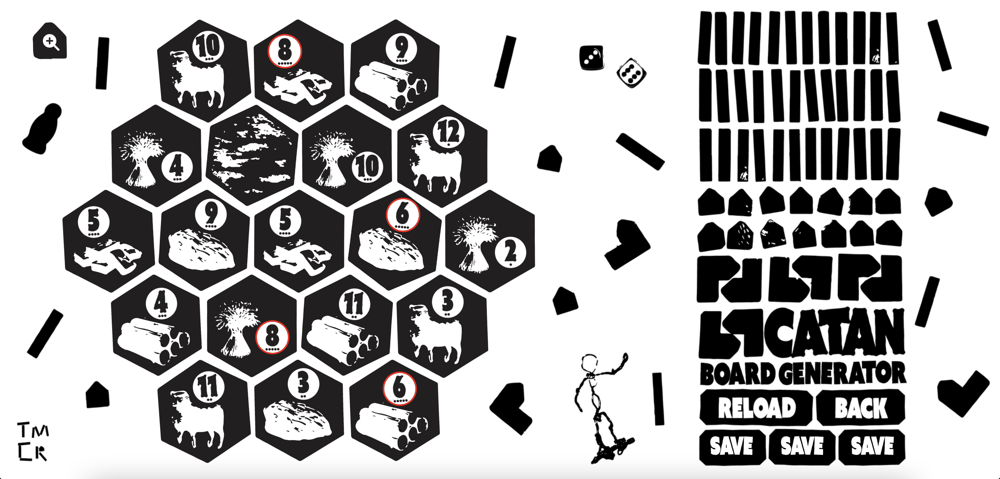

# catan_board_generator
Generate an well-balanced board for the game Settlers of Catan

I might someday launch a full build for this but for right now it was just a fun project to make in an afternoon. I have now used it for several Catan games with friends, and it can provide some pretty interesting and fun setups.

# Technology
Initially, the tile and value placing algorithm was written in Python, then I totally rewrote the algorithm and wrote it in JS/Typescript so that it could be incorporated into the site easier.

The entire site is built with React.js and Typescript. I learned a lot while building this project and now feel my skills are stronger than ever.

Thanks to my friend Cooper for help with the design!


# How To Use (now with less steps!)
1. fork the repo
2. run ```cd catan_generator```
3. run ```npm run dev```
4. done

Alternatively : 
1. visit https://m4ur1n0.github.io/catan_board_generator/ !
2. play around with the unfinished build, or view the (also unfinished) light version with the extension '/light'