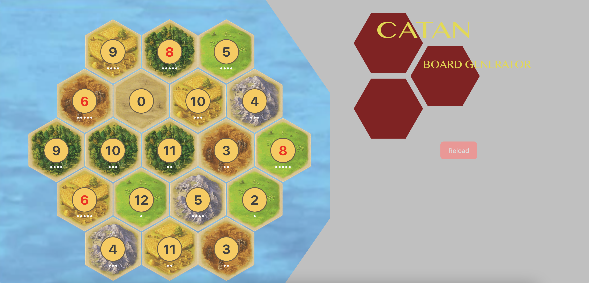

# catan_board_generator
Generate an well-balanced board for the game Settlers of Catan

I might someday launch a full build for this but for right now it was just a fun project to make in an afternoon. I have now used it for several Catan games with friends, and it can provide some pretty interesting and fun setups.

# Technology
I built the algorithm for number dispersion and tile placement in Python and then built the interface using React.js and Typescript. Someday I'll rewrite the Python code in JS so that it can all be run off node (vs. the two-server system I'm currently employing), but again, this was just a fun project I made in an afternoon and this works for my purposes right now.

NEW: I have now removed the Python components as they were unwieldy and unnecessary and always meant to be temporary. The files are still included in the repo if you're curious about what I had been doing. Now, tiles are laid out one-by-one using an algorithm that checks neighbors and neighboring weights to determine the next tile to place. The placing algorithm is now written in Typescript, after being developed in plain Javascript. This results in occasional infinite-loops when two values that aren't allowed to be next to each other are the last 2 that need to be placed. I will be fixing this soon.

# How To Use (now with less steps!)
1. fork the repo
2. run ```cd catan_generator```
3. run ```npm run dev```
4. done

Alternatively : 
1. visit https://m4ur1n0.github.io/catan_board_generator !